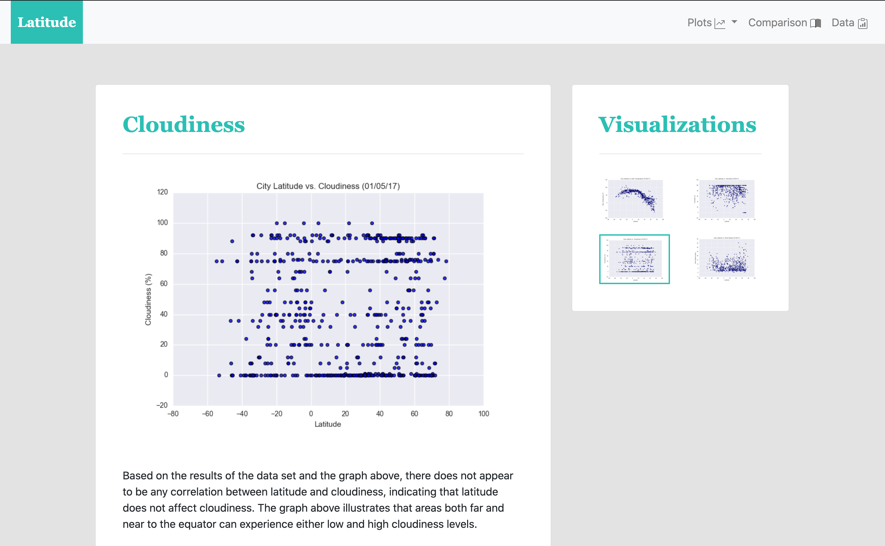

### Problem this project is trying to solve:
What good is collecting data if no one can view it? The purpose of this project is to use HTML and CSS to create a dashboard showing off a weather analysis I've already done (see https://github.com/sfroonjian/API-World-Wide-Weather-Analysis).

### How to run the code:
1. Go to https://sfroonjian.github.io/web-design-challenge/
1. Use the navigation bar and images to navigate through the web pages.

### Web page and data collected:

### Why the data is displayed this way:
The data is displayed in scatter plots so any trends or correlations between latitude and several factors can easily be visualized. Users can view all the plots at once so they can do a side-by-side on the comparisons page, or they can view each plot one at a time with a written analysis.
